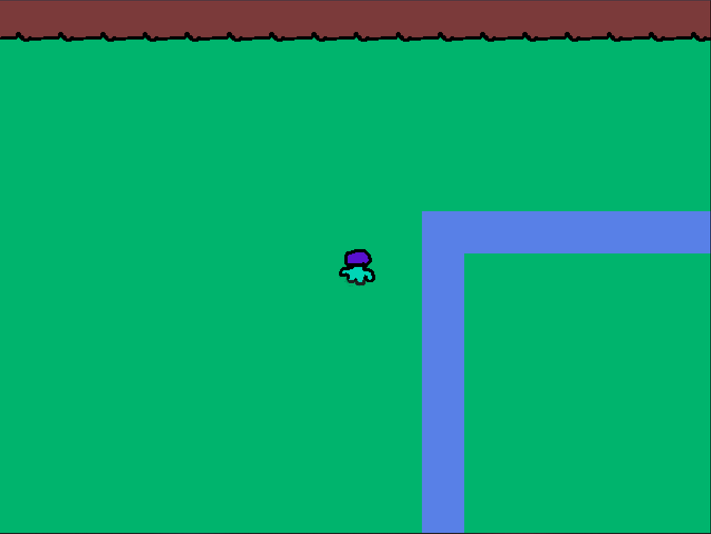

# Tridents of ardeus

A C++ tilemap based game, this is a rebuild of an older [project](https://github.com/Reesy/tridents-of-ardeus) but rewritten with SDL2 so that it can be compiled to the web. 

This game comes with some test code, this project is more to play around with clean code in C++

It's also to test a cleaner architecture _composition over inheritence_


 

You can test the game [here](https://jim.wales/tridents-of-ardeus/)

## Supported platforms

|  Platform         |  Status   |
| ----------------- | --------- |
| Windows - MingGW  |   ✔️      |
| Windows - MSVC    |   ✔️      |
| OSX               |   ✔️      |
| Browser - Emscripten  | ✔️   |
| Browser - Emscripten (with docker) | ✔️   |


## Cloning

Through CLI:

```
git clone https://github.com/Reesy/sdl-tridents-of-ardeus
```

Graphically (this will also generate a project on your profile) 


## Building

This project has a dependency on SDL2 and SDL_image, when building natively these dependencies must be installed on the target machine and they can be discovered through the FindSDL cmake files. When building through emscripten the SDL and SDL2 ports are required (they should exist by default)

<dl>
    <dt> Requirements<dt>
    <dd style='color:red'> CMake -- required to build this project </dd>
<dl>


To build a release (on OSX):

```
cmake . -B build
make
```

To build for browser with Emscripten (requires emscripten installed and on the path): 

```
emcmake cmake . -B build 
```

To build with debug symbols (on OSX):
```
cmake -DCMAKE_BUILD_TYPE=Debug . -B build
make
```

<div style='color:red'> The 'resources' folder needs to exist in the same directory as the .exe file (on OSX it will be automatically bundled into the app</div>


</br>

## Building and hosting on the web
 
_This will create a make file and copy a basic index.html and python script to the embuild folder_
``` 
emcmake cmake -B embuild . 
cd embuild && make
``` 
Serving the file using httpserver with Python 2: ```python -m SimpleHTTPServer 8080``` 

## Hosting with docker  
### Building the image 
_The emscripten build must me run first_

```
emcmake cmake -B embuild . 
cd embuild && make
docker build -t <desired_image_name> .
``` 
 
### Running the image
```
docker run --name <desired_container_name> -p <desired_port>:3000 <desired_image_name> 
```

You will then be able to view the application on ```http://localhost:<desired_port>``` i.e http://localhost:3000
 

# vs-code only

This project comes with a .vscode folder prebundled to make debugging easier, for this to work two plugins are necessary 

<dl>
    <dt> Recommended Plugins<dt>
    <dd style='color:green'>C/C++ Plugin </dd>
    <dd style='color:green'>CodeLLDB* </dd>
<dl>

\*CodeLLDB is only recommended for debugging on modern OSX versions

SDL2 can be found https://www.libsdl.org/


Emscripten command (manually):
    ```emcc src/main.cpp -s WASM=1 -s USE_SDL=2 -s USE_SDL_IMAGE=2 -O3 -o index.js```

    running in small httpserver with Python 2: ```python -m SimpleHTTPServer 8080``` 


Credit for the code in main from: 
    1. http://main.lv/writeup/web_assembly_sdl_example.md#toc-1   
    2. https://www.willusher.io/sdl2%20tutorials/2013/08/27/lesson-5-clipping-sprite-sheets 
